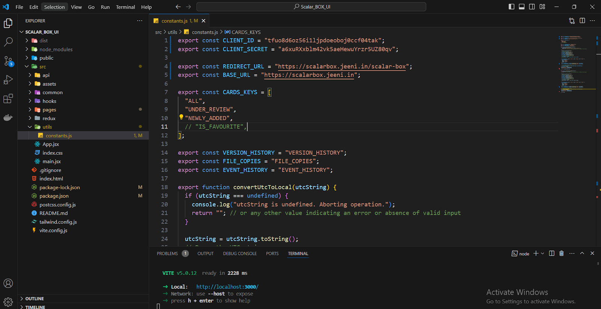

2) Scalar-Box-WebApp UI : 

Scalar-Box-WebApp UI Setup :
        1. Clone Repository:
Clone the repository from the Gitlab : 
        2.  Navigate to Directory:
Go to the directory:  $ cd clone/path/to/Scalar-Box-WebApp

        3. System Prerequisites:
Ensure you have the following installed:
         Node version : 18.17.0

        4. Configure CLIENT_ID, CLIENT_SECRET, REDIRECT_URL  and End-Points Url (BASE_URL) :
Open constant.js file which is available in path : Scalar_BOX_UI\src\utils

5. Commands to Build Application :
npm install (it’ll install all the required dependency)
npm run build

Note : Configuration > OAuth 2.0 Redirect URI section. 
Note: Add your  domain in Configuration >CORS Domains Section of  Scalar-Box-Event-Log-Fetcher-App
Preview Functionality is Used through this setting.
