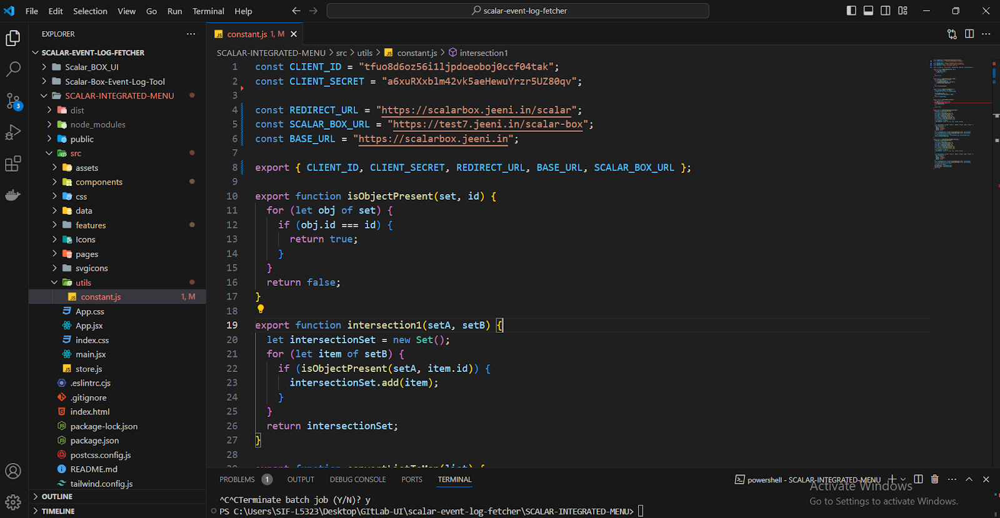

1) Scalar-WebApp-Integration-Menu : This is the application used with the box when the user selects file/folder and chooses to open it with Scalar Auditor for Box.

Scalar-WebApp-Integration-Menu Setup :
        1. Clone Repository:
Clone the repository from the Gitlab : 
        2.  Navigate to Directory:
Go to the directory:  $ cd clone/path/to/Scalar-WebApp-Integration-Menu

        3. System Prerequisites:
Ensure you have the following installed:
         Node version : 18.17.0

        4. Configure CLIENT_ID, CLIENT_SECRET, REDIRECT_URL, SCALAR_BOX_URL  and End-Points Url (BASE_URL) :
Open constant.js file which is available in path : SCALAR-INTEGRATED-MENU\src\utils

5. Commands to Build Application :
•	npm install (it’ll install all the required dependency)
•	npm run build

Note : you have add this redirect url in the in box app(Scalar Auditor for Box) developer console  in

