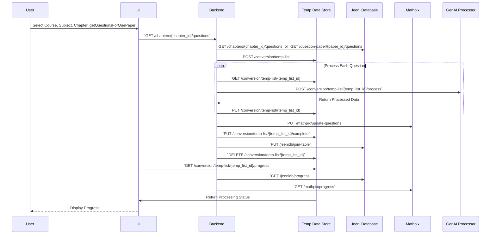

### Sequence Diagram

```mermaid
sequenceDiagram
    participant User as User
    participant UI as UI
    participant Backend as Backend
    participant TempDB as Temp Data Store
    participant JeeniDB as Jeeni Database
    participant Mathpix as Mathpix
    participant GenAI as GenAI Processor

    User ->> UI: Select Course, Subject, Chapter, getQuestionsForQuePaper
    UI ->> Backend: `GET /chapters/{chapter_id}/questions`
    Backend ->> JeeniDB: `GET /chapters/{chapter_id}/questions` or `GET /question-paper/{paper_id}/questions`
    Backend ->> TempDB: `POST /conversion/temp-list`

    loop Process Each Question
        Backend ->> TempDB: `GET /conversion/temp-list/{temp_list_id}`
        Backend ->> GenAI: `POST /conversion/temp-list/{temp_list_id}/process`
        GenAI -->> Backend: Return Processed Data
        Backend ->> TempDB: `PUT /conversion/temp-list/{temp_list_id}`
    end

    Backend ->> Mathpix: `PUT /mathpix/update-questions`
    Backend ->> TempDB: `PUT /conversion/temp-list/{temp_list_id}/complete`
    Backend ->> JeeniDB: `PUT /jeenidb/join-table`
    Backend ->> TempDB: `DELETE /conversion/temp-list/{temp_list_id}`

    UI ->> TempDB: `GET /conversion/temp-list/{temp_list_id}/progress`
    Backend ->> JeeniDB: `GET /jeenidb/progress`
    Backend ->> Mathpix: `GET /mathpix/progress`
    TempDB ->> UI: Return Processing Status
    UI -->> User: Display Progress
```

