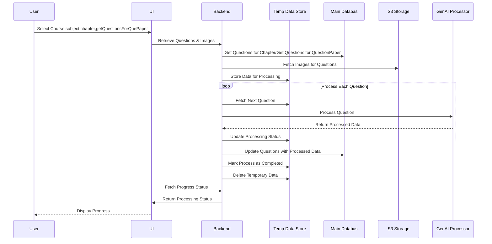

### Sequence Diagram

```mermaid
sequenceDiagram
    participant User as User
    participant UI as UI
    participant Backend as Backend
    participant TempDB as Temp Data Store
    participant JeeniDB as Main Databas
    participant S3 as S3 Storage
    participant GenAI as GenAI Processor

    User ->> UI: Select Course subject,chapter,getQuestionsForQuePaper
    UI ->> Backend: Retrieve Questions & Images
    Backend ->> JeeniDB: Get Questions for Chapter/Get Questions for QuestionPaper
    Backend ->> S3: Fetch Images for Questions
    Backend ->> TempDB: Store Data for Processing

    loop Process Each Question
        Backend ->> TempDB: Fetch Next Question
        Backend ->> GenAI: Process Question
        GenAI -->> Backend: Return Processed Data
        Backend ->> TempDB: Update Processing Status
    end

    Backend ->> JeeniDB: Update Questions with Processed Data
    Backend ->> TempDB: Mark Process as Completed
    Backend ->> TempDB: Delete Temporary Data

    UI ->> Backend: Fetch Progress Status
    Backend ->> UI: Return Processing Status
    UI -->> User: Display Progress


```
