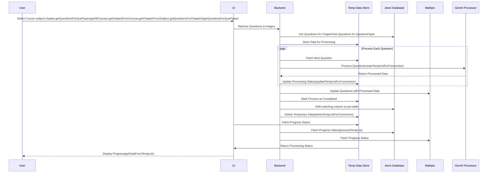

### Sequence Diagram

```mermaid
sequenceDiagram
    participant User as User
    participant UI as UI
    participant Backend as Backend
    participant TempDB as Temp Data Store
    participant JeeniDB as Jeeni Database
    participant Mathpix as Mathpix
    participant GenAI as GenAI Processor

    User ->> UI: Select Course subject,chapter,getQuestionsForQuePaper(getAllCourses,getSubjectFromCourse,getChapterFromSubject,getQuestionsForChapter)/(getQuestionsForQuePaper)


    UI ->> Backend: Retrieve Questions & Images
    Backend ->> JeeniDB: Get Questions for Chapter/Get Questions for QuestionPaper
    Backend ->> TempDB: Store Data for Processing

    loop Process Each Question
        Backend ->> TempDB: Fetch Next Question
        Backend ->> GenAI: Process Question(createTempListForConversion)
        GenAI -->> Backend: Return Processed Data
        Backend ->> TempDB: Update Processing Status(updateTempListForConversion)
    end

    Backend ->> Mathpix: Update Questions with Processed Data
    Backend ->> TempDB: Mark Process as Completed
    Backend ->> JeeniDB: Shift matching column to join table
    Backend ->> TempDB: Delete Temporary Data(deleteTempListForConversion)


    UI ->> TempDB: Fetch Progress Status
   Backend ->> JeeniDB: Fetch Progress Status(processTempList)
  Backend ->> Mathpix: Fetch Progress Status 
    TempDB ->> UI: Return Processing Status
    UI -->> User: Display Progress(getDataFromTempList)


```
